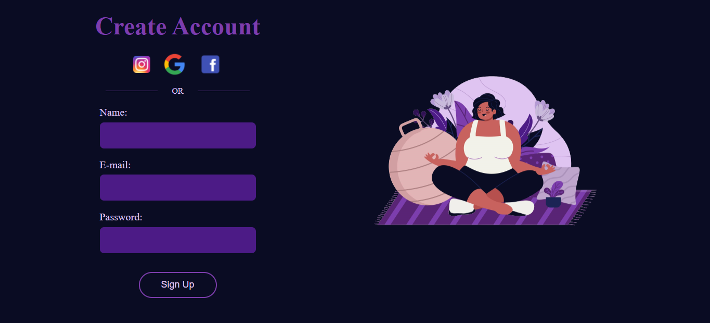
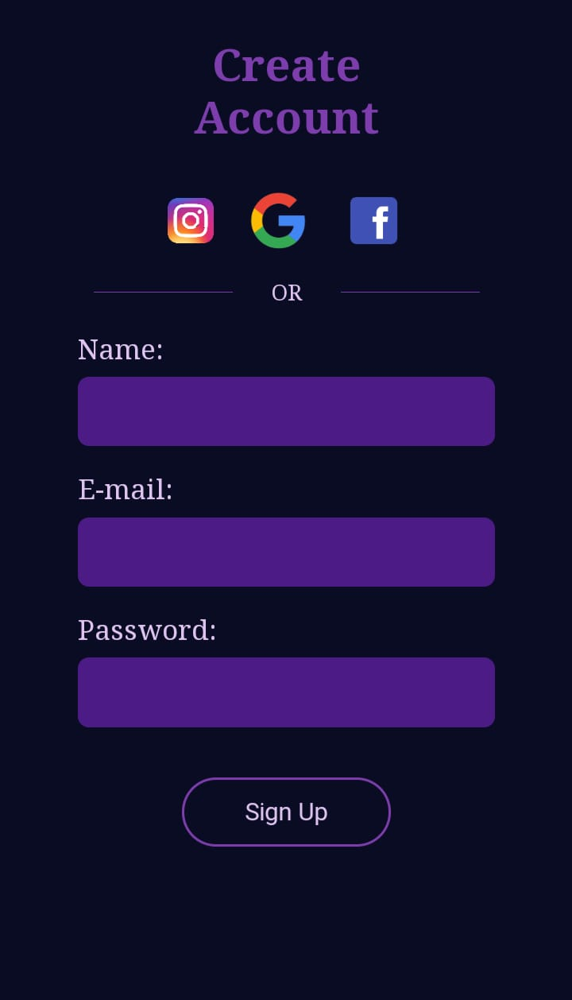

<h1 align="center">Página de Login  💻📁✨</h1>

<h3 align="center">🚧🛠 Projeto, em contrução... 🚧</h3>
 

Este projeto consiste na criação de uma página de login, tendo como objetivo a prática no desenvolvimento em HTML5, CSS3 e Responsividade.

Visite minha página do Github para conhecer o projeto: <a href=" https://thaay93.github.io/login_pag">PROJETO LOGIN_PAGE.🥰🤩 </a>

<h2> 💻 Versão Desktop </h2>

 

<h2> 📱  Versão Mobile</h2>

 

<h2> 🛠⚙️Tecnologias </h2>

Para o desenvolvimento deste projeto usei as seguintes tecnologias:

<ul>
    <li>HTML5;</li>
    <li>CSS3;</li>
    <li>VS Code;</li>
    <li>Git.</li>
</ul>
 

<h2>⚖️📋 Licença</h2>

Esse projeto está sob licença MIT. Veja o arquivo <a href="https://github.com/thaay93/login_page/blob/main/LICENSE">LICENÇA</a> para mais detalhes.
 

<h2>Autor</h2>

Desenvolvido com ❤️ por Taynara Martins 🐷🛸. Entre em contato! 👋

